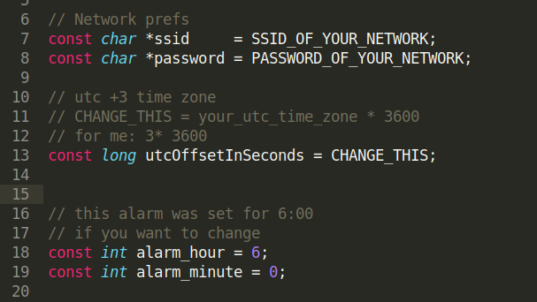
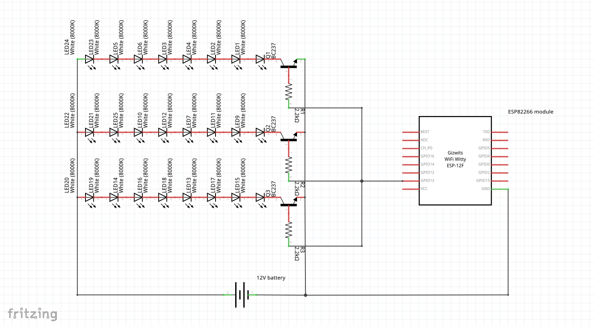
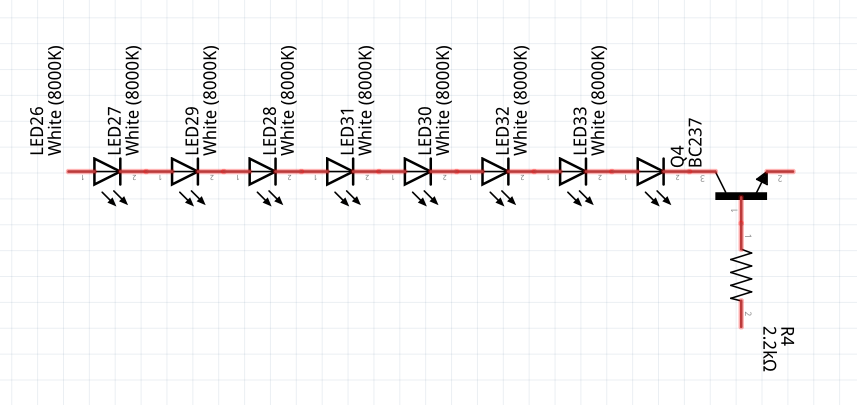

# Simple Sunrise Clock

This project is a *minimalist* sunrise clock. it checks time with NTP over internet, and lights the leds when the alarm is on. This project doesn't have an external crystal for time tracking, just NTP.

## Code
There are some changes you need to do in the source(8266_code/ntpclient.ino).

You should change these variables on top. First of all you should register your esp8266 on your network with ssid and password. Also you should change your timezone with (timezone * seconds in an hour), for example; let's say you are in GMT+3 time zone your 'utcOffsetInSeconds' will be (3*3600) 10800.

## Scheme
The basic scheme is down below, also you can do some changes for your prefences. I had led strip with 1.5V white leds and 12V power amp so this design was created.

In the scheme you can see 4 lines of led blocks with a single BC237/BC238 transistors and a single 2.2K ohm resistor. these blocks can be multplied by your needings and preferences, also you can change number of leds in a single block.

Note: there are some photos of my mounted breadboard 

## Disclaimer:
*You need to power your esp with another powersource.
*This project doesn't have a external time crystal.
*If your want to set the alarm off you need to unplug the system.
*required libraries are below:
	*NTPClient.h https://github.com/arduino-libraries/NTPClient
	* ESP8266WiFi.h https://github.com/esp8266/Arduino/blob/master/libraries/ESP8266WiFi/src/ESP8266WiFi.h
